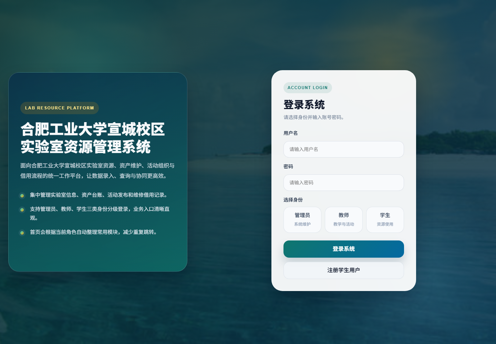
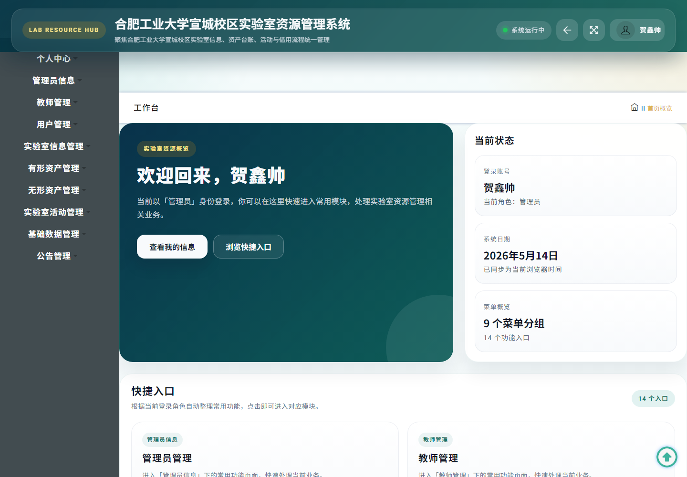
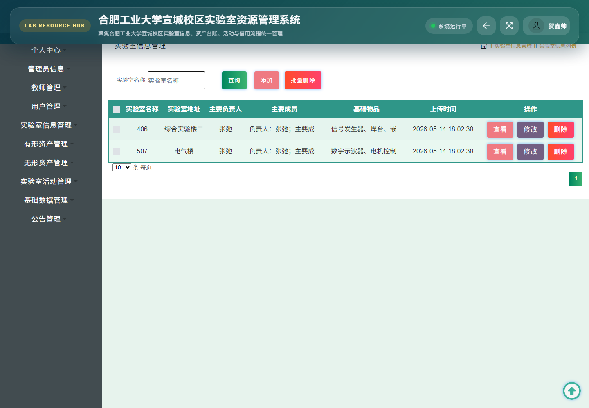
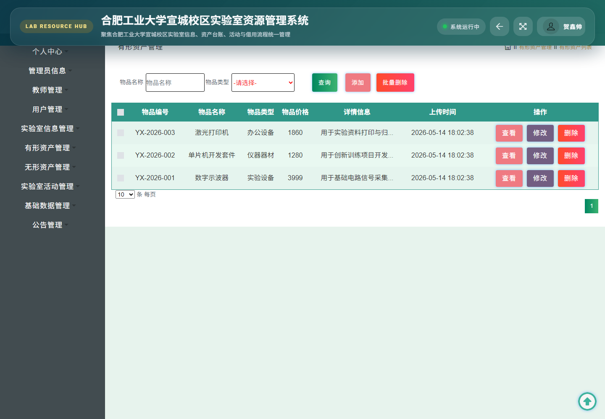

# 合肥工业大学宣城校区实验室资源管理系统

`hfutxclabresourcemanage`


## 项目简介

本项目是面向高校实验室日常管理场景的 Java Web 管理系统，围绕实验室基础信息、资产台账、无形资源、实验室活动、请假审核、借用记录、维修记录和公告发布等业务进行设计与实现。

系统采用 Spring + Spring MVC + MyBatis-Plus + JSP 的传统 Java Web 架构，配套 MySQL 初始化脚本，可用于软件工程课程答辩、实验室资源管理原型演示和二次开发参考。

## 系统预览

### 登录页



### 工作台



### 实验室信息管理



### 有形资产管理



## 功能模块

| 模块 | 说明 |
| --- | --- |
| 管理员管理 | 管理后台管理员账号与基础信息 |
| 教师管理 | 维护教师账号、资料和教学活动关联 |
| 学生用户管理 | 维护学生用户信息和使用权限 |
| 实验室信息管理 | 管理实验室名称、地址、负责人、成员和基础物品 |
| 有形资产管理 | 管理实验设备、仪器器材、办公设备等资产台账 |
| 无形资产管理 | 管理制度文档、规范文件等无形资源，并支持审核状态 |
| 实验室活动管理 | 发布实验教学、学术讲座、竞赛培训等活动 |
| 请假管理 | 记录学生请假申请和审核状态 |
| 借用记录管理 | 记录资产借用人、借用时间和关联资产 |
| 维修记录管理 | 记录资产维修时间、维修费用和状态 |
| 公告管理 | 发布通知公告和新闻动态 |

## 技术栈

| 层级 | 技术 |
| --- | --- |
| 后端 | Java 8, Spring, Spring MVC, MyBatis-Plus |
| 前端 | JSP, jQuery, Bootstrap, Layui |
| 数据库 | MySQL 8.x |
| 构建与部署 | Maven, Tomcat 9 |
| 初始化数据 | `local/init.sql` |

## 目录结构

```text
hfutxclabresourcemanage
├─ local
│  └─ init.sql                  # 数据库建表与演示数据
├─ docs
│  └─ screenshots               # README 展示截图
├─ src
│  └─ main
│     ├─ java                   # Controller、Service、DAO、Entity
│     ├─ resources              # Spring/MyBatis/数据库配置
│     └─ webapp                 # JSP 页面与静态资源
├─ pom.xml
└─ README.md
```

## 运行环境

- JDK 8
- Maven 3.x
- MySQL 8.x
- Tomcat 9.x

## 快速运行

1. 创建数据库并导入初始化脚本：

```sql
SOURCE local/init.sql;
```

2. 按本机环境修改数据库连接配置：

```properties
# src/main/resources/config.properties
jdbc_url=jdbc:mysql://127.0.0.1:3307/gaoxiaoshiyanshizhiyuan?useUnicode=true&characterEncoding=UTF-8&tinyInt1isBit=false&useSSL=false&serverTimezone=Asia/Shanghai
jdbc_username=root
jdbc_password=your_password
```

3. 使用 Maven 打包：

```bash
mvn clean package -DskipTests
```

4. 将生成的 WAR 包部署到 Tomcat：

```text
target/hfutxclabresourcemanage.war
```

5. 启动 Tomcat 后访问：

```text
http://127.0.0.1:8080/hfutxclabresourcemanage/
```

## 演示账号

初始化脚本内置了三类演示账号，默认密码均为 `123456`。

| 角色 | 用户名 | 说明 |
| --- | --- | --- |
| 管理员 | 贺鑫帅 | 系统维护、基础数据和全部业务模块管理 |
| 教师 | 张弛 | 教学活动、实验室活动等教师侧业务 |
| 学生 | 胡俊贤 | 学生信息、请假和资源使用相关业务 |

## 数据说明

`local/init.sql` 会创建 `gaoxiaoshiyanshizhiyuan` 数据库，并写入课程演示用的实验室、资产、用户、活动、请假、借用、维修和公告数据。

如需用于公开展示、二次开发或重新部署，可根据实际场景替换演示账号、样例数据和数据库连接信息。
